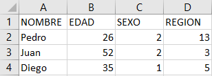

```{r echo=FALSE}
knitr::opts_chunk$set(out.width="80%", fig.pos = "!ht", out.extra = "")
```


```{r, echo=FALSE, message=FALSE}
library(haven)
library(dplyr)
library(sjPlot)
library(sjlabelled)
library(readxl)
```

# La calidad de los datos

Hasta ahora nos hemos centrado más en los metadatos, las infraestructuras y los ciclos organizacionales que en los datos mismos. Como también señalan los principio y consensos revisados anteriormente es necesario que los datos cumplan con ciertos estándares relacionados especialmente con la calidad de los datos. Una tarea fundamental de un repositorio de materiales de investigación es que sus materiales sean utilizables por distintos investigadores independiente de las herramientas y softwares que utilizan. 
Para que los datos logren este objetivo deben poseer ciertas características que se distingue según el tipo de datos. Mientras en los datos cualitativos lo importante es el registro de las interacciones, las tomas de decisiones y los cuadernos de campo, en los datos cuantitativos es importante que se garantice una cantidad suficiente de etiquetas en base a codificaciones que no generen conflicto con algún software de análisis. 


## Datos cualitativos:

Para preparar y ordenar los datos cualitativos se requiere cumplir tanto con aspectos de contenido como de forma.

En términos de contenido es importante archivar toda la documentación relacionada con el proceso de la investigación. Un elemento fundamental es el almacenamiento de las transcripciones de las entrevistas, grupos focales o grupos de discusión. En consideración de que al estar presente en la entrevista se cuenta con una mayor información que solo leyendo su transcripción cualquier anotación que dé cuenta del ambiente anímico de la entrevista o del gesto que acompaña alguna frase es bienvenida. También es importante subir la pauta de la entrevista si es que existe. Asimismo, aquellos investigadores que hacen un análisis mediante codificación tienen registro del proceso por el cual llegaron a los códigos utilizados para la categorización de la información. Además, esto puede ser complementado con la descripción de las discusiones que surgieron entre el equipo de investigación para establecer tales códigos y el esquema de análisis [@kapiszewski_Transparency_2019]. Igualmente, necesario es cambiar el texto lo que sea necesario para que los sujetos de investigación no puedan ser identificados. también es conveniente compartir el cuaderno de campo de la investigación. 

Esta información bien almacenada no solo ayudara a las ciencias sociales por su apoyo con información a otros investigadores, sino que conjuntamente es un gran aporte a la formación de los estudiantes sobre como investigar cualitativamente, pues estos materiales permiten una aproximación más concreta al proceso de investigación cualitativo @bishop_Revisiting_2017.


En términos de formato es necesario seguir dos principios que en ocasiones pueden ser contrapuestos. En primer lugar, es necesario almacenar la información en formatos que sean ampliamente compartidos y utilizados en el campo de investigación. En segundo lugar, es necesario guardar los datos en formatos libres, que si bien no siempre son utilizados, a diferencia de los formatos propietarios pueden ser abiertos por personas de distintos países y hacen los datos perdurables incluso después de que el formato ampliamente sea desechado. Para cumplir con ambas exigencias se recomienda subir los documentos en distintos formatos. 


Formatos para documentos de texto:

* .pdf

* .txt

Formatos para grabaciones: 

* .mp3

* .ogg

Formatos para imágenes:

* .png

* .jpg

## Datos cuantitativos: Algunos aspectos sobre los sofware  estadisticos: R, SPSS, STATA y SAS.

Considerando el principio de la interoperabilidad de los datos, es necesario que la curatoria adapte los datos para ser procesados por distintos sofware. Para ello es necesario evaluar cuales son las condiciones en las que pueden trabajar los sofwares más usados en la disiplina tale somo R, SPSS y STATA.

Respecto a la cantidad maxima de caracteres para el nombre de una variable se señala en los manuales que el maximo es 8, aunque se pueden guardar hasta 65, no obstante es probable que se generen problemas al trabajar con la variable. Ademas de la cantidad de caracteres es importante recordar que los nombres no deben llevar espacios en blanco, sino guiones bajos. 

Uno de los aspectos a considerar es cual es la cantidad maxima de caracteres que puede poseer una etiqueta de variable. Mientras que STATA soporta 240 caracteres en las etiquetas SPSS puede soportar 120 caracteres [Manual SPSS](https://www.um.es/docencia/pguardio/documentos/spss_3.pdf). En consideración de dicha limitación creemos que es optimo restringirse al maximo de 120 caracteres incluyendo espacios. 

 - Las mismas variables en distintas olas deben tener el mismo nombre. Las variables que ayuden a conectar casos, por ejemplo cuestionarios de padres y aporderados (id-estudiante) en ambas bases.  las variables para hacer merge  


### Bases de datos y curatoria 

Una base de datos es un conjunto de información organizada de modo estructural que permite almacenar distintas capas de información.  Las bases de datos no son equivalentes a las matrices (Ver ejemplo de matriz en imagen 1) pues poseen más información además de las variables, lo casos y los valores, como la descripción de las variables, las etiquetas de las categorías o el tipo-clase de información contenida. Incluso las bases de datos pueden contener información sobre el formato en el que están (p ej. SPSS). De hecho, al pasar una base de datos a una simple matriz se pierde información. 

En este ejemplo de matriz, podemos ver como la información contenida simplemente posee el nombre de los sujetos (a,b,c), las variables (1,2,3) y los valores ("y", "x").

```{r}
a <- c("1","2","3")
b <- c("3","2","1")
c <- c("2","3","1")
matris<-as.matrix(rbind(a,b,c))
matris
```

Ahora veamos la estructura de esta matriz en base al argumento str del sofware R, el cual nos permite visualizar los componentes de un objeto.
```{r}

print(str(rbind(a,b,c)))
```

Como se puede ver la estructura de la matriz es relativamente simple. A continuación, se expone la estructura de una base de datos del centro COES, la base [ELSOC](), esta base fue recortada para solo poseer tres variables como la matriz anterior. Si bien es bastante complejo leer la estructura de la matriz y la base de datos, para este ejercicio basta con darse cuenta de que la base de datos posee una estructura más compleja y mayor información que la matriz.


```{r}
ELSOC <- read_dta("ELSOC_W01_v2.00_Stata14.dta")
ELSOC_3 <- select(ELSOC, t01, r01_01, c01)

print(str(ELSOC_3))
```

Ahora bien, la utilidad de tener una buena base de datos, con etiquetas, variables y categorías bien estructuradas, es que facilita el análisis y el trabajo con la base de dato de modo tal que los gráficos de los programas reconocen esta estructura. Además, tener la base de datos bien estructurada y con información permite identificar las variables de modo correcto, disminuyendo los posibles errores. A continuación, podemos ver la misma base de datos de la cual evaluamos a estructura, a partir de un código que genera un libro de códigos automáticos.

```{r}
sjPlot::view_df(ELSOC_3, show.type = T)
```

Por el contrario, si tenemos una "base de datos" que es creada en excel como en la imagen posterior, sin estructurar el contenido sobre las etiquetas de las variables ni las etiquetas de los valores y utilizamos el mismo código para la creación un libro de códigos, este no será muy informativo. Esto dificultaría el trabajo con esta base de datos, haciendo necesario agregar las etiquetas manualmente facilitando errores de codificación.  


```{r echo=FALSE, fig.align='center'}

```

```{r}
Mal_ejemplo <- read_excel("EJEMPLOMALABASE.xlsx")
sjPlot::view_df(Mal_ejemplo)
```


Además de que las bases de datos se encuentren bien estructuradas es importante que las etiquetas de las variables y las categorías se encuentren codificadas en "UTF-8" para que las letras puedan ser interpretadas por algunos softwares. Además de tener este tipo de codificación, es necesario que las bases de datos no posean tildes ni signos especiales (p. ej ¿ " , ;), preferentemente solo dígitos alfanuméricos. De lo contrario se generan problemas de codificación que resultan en errores visibles como los que se presentan a continuación. 

```{r}
EncuestaCEPjul <- read_sav("EncuestaCEPjul.sav")
Encuesta_CEP <- select(EncuestaCEPjul, SV1, MB_P2, ELE_7_1)
sjPlot::view_df(Encuesta_CEP, encoding = "UTF-8")
```

Junto de la importancia de la estructura de la base de datos, las etiquetas y la codificación es necesario revisar algunos otros puntos sobre una base de datos sociales antes de subirla, como lo pueden ser el tema de la documentación necesaria o el tema de la privacidad, a continuación, haremos una revisión de los distintos temas que son importantes para la publicación de una base de datos. 

El proceso de preparación por el cual se llega a una base bien etiquetada, bien codificad y anonima se denomina __curatoria__. Por ello, la curatoria de datos es fundamental antes de compartir una base de datos para que todos los usuarios de ella puedan comprender adecuadamente su contenido y trabajar con la menor cantidad de complicaciones.
