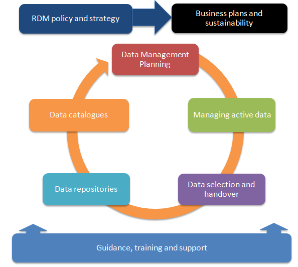
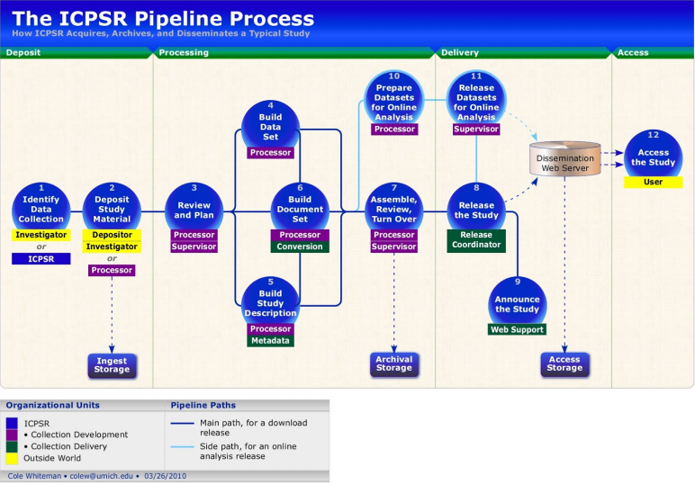
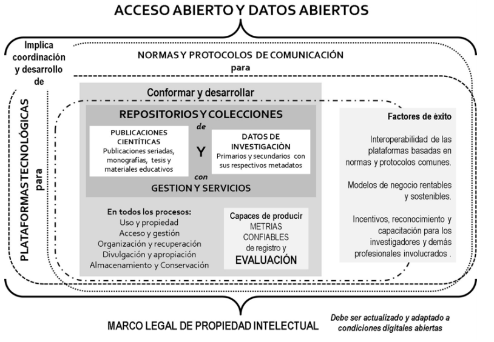

```{r echo=FALSE}
knitr::opts_chunk$set(out.width="80%", fig.pos = "!ht", out.extra = "") 
```

# Estándares y sugerencias sobre la preservación de datos

Para poder generar una ciencia social más colaborativa y eficiente, es necesario que la comunidad de las ciencias sociales compartan estándares compartidos respecto a la calidad de los datos y del almacenamiento. De este modo los trabajos de investigación y los materiales de por si complejos serán más faciles de comprender y ser utilizados por terceros. 

En la sección actual se revisarán tanto declaraciones de instituciones relacionadas con la Curatoría y el mantenimiento de los datos, como documentos que fijen normas comunes para el almacenamiento. El objetivo es recopilar y sistematizar los estándares de calidad para un repositorio abierto de datos. Posteriormente, evaluaremos distintos repositorios a partir de los criterios de la calidad sistematizados, buscando ventajas y desventajas de distintas experiencias en el almacenamiento de bases de datos de investigación social, junto con aquellos aprendizajes que puedan desprenderse.

El resultado final de este trabajo será una propuesta de almacenamiento acorde a los estándares internacionales y un manual que facilite a los usuarios seguir estos estándares.

A continuación se revisaran los siguientes estándares internacionales. 

* Acceso abierto ICSU

*	FAIR

* DMP

*	RISE-DDC

*	Tubería de datos ICSPR

*	OASIS - Research Managament Data.

*	Esquema CILAC.

## Acceso abierto ICSU
 
 El Consejo Internacional para la Ciencia [@icsu_Open_2014] defiende los siguientes objetivos para la apertura. El registro científico debe ser:

* libre de barreras financieras a las que pueda contribuir cualquier investigador;

* libre de barreras financieras para que cualquier usuario acceda inmediatamente después de la publicación;

* disponible sin restricción de reutilización para cualquier propósito, sujeto a
atribución adecuada;

* calidad garantizada y publicada de manera oportuna; y

* archivado y disponible a perpetuidad

Para alcanzar estos objetivos @ics_Open_2020 señala que las instituciones financiaras y las universidades deben fortalecer las capacidades para alinearse con los principios FAIR, los cuales presentamos a continuación. 

## Principios FAIR:  Datos, Metadatos e infraestructura digital. 

Los principios de almacenamiento FAIR (Findable, Accessible, Interoperable, Reusable), son ampliamente reconocidos a nivel mundial. Estos principios han sido promovidos por organizaciones científicas regionales como CILAC [@ramirez_Ciencia_2019] y Europeas [@ec_FAIR_2016]. En Chile ANID del ministerio de ciencias, ha señalado la política de acceso a datos que impulsará se guiara por los principios FAIR.

Los principios FAIR, son sumamente compatibles con las diversas formas de información producida por las ciencias sociales, ya sean documentos de texto, audiovisuales o bases de datos. Este es un buen motivo para fomentar los principios FAIR en todos los tipos de investigaciones en ciencias sociales.

El objetivo general de estos principios es que los productos de investigación estén disponibles en la web, de modo tal que puedan ser buscados directamente por investigadores o por inteligencia artificial [@gofair_FAIR_2020]. A continuación, se explican estos principios y como pueden ayudar a las ciencias sociales.


```{r echo=FALSE, fig.align='center', fig.cap=""}
knitr::include_graphics("images/FAIR_data_principles.JPG")
```

Los principios se refieren a tres tipos de entidades: _"datos"_ (o cualquier producto de investigación como objeto digital), __"metadatos"__ (información sobre ese objeto digital) e infraestructura digital (Capacidades y herramientas necesarias en repositorios web). 


### __Findable__ _("Encontrables")_

El primer paso para (re) usar datos es encontrarlos. Los metadatos y los datos deben ser fáciles de encontrar tanto para humanos como para computadoras. Los metadatos legibles por máquina son esenciales para el descubrimiento automático de conjuntos de datos y servicios, por lo que este es un componente esencial del proceso de FAIRification .

> F1. A los datos se les asigna un identificador único y persistente a nivel mundial.

Los identificadores únicos eliminan la ambigüedad, facilitando que una investigación, una base de datos o cualquier producto de investigación, no sea confundido con otro producto por tener un nombre o características similares.

Los ejemplos más comunes de identificadores son los URL (Localizador Uniforme de Recursos) los cuales asignan un sitio único a cada página web, como los URL “www.google.com” o “www.youtube.com”. Otro tipo de identificadores más cercano a las ciencias sociales son los ISBN (Número Internacional Normalizado del Libro) o el DOI (Identificador de Material Digital) que solemos ver asociados a los artículos de investigación. A diferencia del URL el doi no cambia, aunque el material cambie de ubicación en la web. Así, los identificadores se asocian de forma única a los datos (Bases de datos, entrevistas, transcripciones), como es el ejemplo de este doi https://doi.org/10.5064/F6HTXF0H que corresponde al identificador de un conjunto de materiales y Focus Groups sobre género y participación en el desarrollo comunitario en Senegal.

Estos identificadores también ayudarán a que el trabajo sea más fácilmente compartido, reconocido y posea un mayor impacto. En la misma línea, facilita su citación puesto que, al ingresar estos identificadores en gestores de citas como Zotero, se genera una referencia bibliográfica automática. 

Para generar un identificador único se pueden usar paginas especializadas que pueden encontrarse en [DoiChile]( https://doichile.cl/conseguir-doi/). También, para facilitar el trabajo, muchos repositorios de datos generarán automáticamente identificadores persistentes y únicos a nivel mundial para los conjuntos de datos depositados. 

> F2. Los datos se describen con metadatos enriquecidos (definidos por R1 a continuación)

Los metadatos son información sobre los datos. Los archivos comunes poseen metadatos automáticos, por ejemplo, Word registra el creador y la fecha. Los principios FAIR, señalan la importancia de incluir metadatos generosos y extensos, incluida información descriptiva sobre el contexto, la calidad y condición, o las características de los datos. En ciencias sociales es importante entregar información sobre la muestra y el proceso de recopilación de datos, así como cualquier información útil para que el investigador que recurra a ellos pueda tomar decisiones correctas.

> F3. Los metadatos incluyen de forma clara y explícita el identificador de los datos que describen

Junto con los identificadores y los metadatos para que los datos sean fáciles de encontrar es necesario que se encuentren disponible en algún recurso de búsqueda. Google es el recurso de búsqueda más conocido. Para los datos de ciencias sociales es importante que estas bases de datos se encuentren disponibles en buscadores de instituciones de investigación o bibliotecas.

> F4. Los datos y metadatos se registran o indexan en un recurso de búsqueda

Junto con los identificadores y los metadatos para que los datos sean fáciles de encontrar es necesario que se encuentren disponible en algún recurso de búsqueda. Google es el recurso de búsqueda más conocido. Para los datos de ciencias sociales es importante que estas bases de datos se encuentren disponibles en buscadores de instituciones de investigación o bibliotecas.

### __Accesibles__ 

> A1. Los datos y metadatos son recuperables por su identificador utilizando un protocolo de comunicaciones estandarizado

Esto significa que los identificadores permiten la redirección a una página web especifica que contiene los datos, esto se puede ver en el identificador cuando posee un http al comienzo. De este modo, basta con poner identificador en la barra del navegador para poder acceder a la página de los datos mediante solo “un click”.

> A1.1  El protocolo es abierto, gratuito y de implementación universal

Este sub-punto refiere a que la forma en que se puede acceder a la pagina web mediante el identificador es universal, es decir, cualquier persona con un computador e internet puede acceder. Lo contrario a esto sería dejar el documento en un sitio web que sea pagado o que no esté disponible a nivel mundial.

> A1.2  El protocolo permite un procedimiento de autenticación y autorización, cuando sea necesario

Además, el modo por el cual se accede a los datos mediante el identificador puede tener algunas solicitudes o exigencias para el usuario. Así, FAIR, no es sinónimo de OpenData, pues se puede tener un dato altamente restringido por distintas razones, pero si se especifican bien las condiciones para su acceso, entonces un dato no “abierto” puede ser FAIR.

> A2 . Los metadatos son accesibles, incluso cuando los datos ya no están disponibles

Suele ocurrir que los datos en internet desaparecen por que mantenerlos implica un costo. Este punto señala como necesario que pese a que desaparezcan los datos los metadatos, que son más fáciles y económicos de almacenar, deben ser persistentes, es decir, deben mantener su existencia en la web. 


### __Interoperables__ 

Los datos normalmente deben integrarse con otros datos. Además, los datos deben interoperar con distintas aplicaciones o flujos de trabajo para análisis, almacenamiento y procesamiento. Para que esto sea posible, es necesario que los datos se encuentren en formatos que sea legibles y trabajables por distintos softwares. 

> i1. Los datos y metadatos utilizan un lenguaje formal, accesible, compartido y de amplia aplicación para la representación del conocimiento.

Para que los datos puedan ser encontrados por las herramientas como barras de búsqueda es necesario que los términos utilizados en los metadatos para describir el estudio sean parte de un Vocabulario controlado, los cuales sirven para sistematizar los sinónimos dentro de un campo temático [@collins_Social_2015]. Esto permite que al buscar un término por ejemplo "relaciones de pareja" en un repositorio de materiales de investigación también aparezcan aquellos materiales que descritos con el término "noviazgo". Los vocabularios controlados utilizados por repositorios de investigación suelen ser denominados también tesauros u ontologías. 


Además es necesario que los metadatos esten estructurados en base a esquemas comunes. Al respecto existen múltiples modos de organizar los metadatos como DDI, Dublin Core, JSON, entre otros. Sin la intención de profundizar en el tema es necesario señalar que no existen amplios consensos en el uso de un estándar de metadatos en Ciencias sociales y humanidades [@gomez_Datos_2016], por lo cual se considera adecuado que un repositorio permita almacenar los metadatos en distintos formatos.


> i2. Los datos y metadatos usan vocabularios que siguen los principios FAIR

Es importante que los vocabularios controlados utilizados para la descripción de los datos sigan principios FAIR, es decir, posean identificadores y metadatos adecuados para poder localizar el vocabulario controlado al que se hace referencia. 

Un ejemplo de vocabulario controlado que sistematiza los sinónimos de distintos idiomas para "journal article" se puede encontrar [aquí](http://vocabularies.coar-repositories.org/pubby/resource_type/c_6501.html). Este ejemplo cumple en buena medida con los principios FAIR

> i3. Los datos y metadatos incluyen referencias calificadas a otros datos y metadatos

Los datos y la información referida a ellos deben tener múltiples vínculos web que permitan acceder a información asociada. Por ejemplo, si tenemos una investigación que ha utilizado datos de una encuesta publicada, se debe hacer alusión a dicha encuesta a partir de su identificador. Del mismo modo se puede hacer vínculos con instituciones asociadas, o páginas de proyectos de investigación propias o estatales.


### __Reutilizables__

El objetivo final de la feria es optimizar la reutilización de los datos. Para lograr esto, los metadatos y los datos deben estar bien descritos para que puedan replicarse y / o combinarse en diferentes entornos.

> R1. Los datos y metadatos se describen detalladamente con una pluralidad de atributos precisos y relevantes

Para que un usuario decida si utilizar los datos o no, debe contar con una gran cantidad de información detallada. Este punto es similar a F2 (Metadatos suficientes), pero destaca la importancia de información particular del campo de uso. Para ello, en ciencias sociales, es importante describir cuando fue realizada la muestra, a quienes se le aplica, si posee control de variables experimentales, entre otras informaciones relevantes. Se debe señalar la mayor información posible, incluyendo tipo de muestreo, intención de la creación de la base de datos, entre otros. Esta información debe ser plural para fomentar el uso más allá de las ciencias sociales.


> R1.1. Los datos y metadatos se publican con una licencia de uso de datos clara y accesible

Los datos deben ser publicados con una licencia que permita su reutilización. Se recomienda en general utilizar licencias Creative Commons, estas licencias permiten a los dueños de los materiales dejar a libre disposición los datos producidos, aunque señalando aquellas condiciones en las cuales se pueden utilizar y aquellas en que no. Esta es una condición más legal que técnica para la reutilización de los datos. 

> R1.2. Los datos y metadatos están asociados con la procedencia detallada

Este punto refiere a entregar información sobre los productores y el flujo de trabajo. También en este punto se debe destacar como se debe citar la base de datos. Entonces, se deben responder las siguientes preguntas ¿Quien estuvo a cargo del diseño? ¿Quién a cargo del terreno y la aplicación? ¿Quién edito los datos? ¿Cómo desea que este material este referenciado?

> R1.3 . Los datos y metadatos cumplen con los estándares comunitarios relevantes para el dominio

Los datos y los metadatos deben estar nombrados y ordenados de modo coherente con los estandares de las ciencias sociales. Por ejemplo, las bases de datos deben estar estructuradas de tal modo que los sujetos sean las filas y las variables las columnas. La documentación que se entrega esta nombrada con terminos comunes, como manual de usuario o cuestionario.  

Segun la investigación de @gomez_Datos_2016, el esquema metadatos más utilizados en las ciencias sociales es el de DDC. No obstante, existe una gran divergencia respecto a cuales deben ser los metadatos incluidos. 


```{r echo=FALSE, fig.align='center', fig.cap=""}
knitr::include_graphics("images/FAIR_data_principles2.JPG")
```

## DMP

Los planes de manejo de datos (DMP) son una herramienta utilizada por la comisión europea (EC) para mejorar la producción y almacenamiento de datos producidos por investigaciones, consiste en una planificación respecto al ciclo de vida de los datos desde su creación hasta su preservación. En este sentido son una herramienta para la organización y estandarización del manejo de datos. 

En un documento de apoyo para investigadores la @ec_FAIR_2016 A modo de sintesis proponen documentar los siguientes puntos respecto al manejo de los datos 

Componente DMP Problemas que deben abordarse

1. __Resumen de datos__

* Indique el propósito de la recopilación / generación de datos
* Explicar la relación con los objetivos del proyecto.
* Especificar los tipos y formatos de datos generados / recopilados
* Especifique si los datos existentes se están reutilizando (si corresponde)
* Especificar el origen de los datos
* Indique el tamaño esperado de los datos (si se conoce)
* Describa la utilidad de datos: para quién será útil

2. __Datos FAIR__

2.1. Haciendo que los datos se puedan encontrar, incluidos
disposiciones para metadatos

* Describir la capacidad de descubrimiento de datos (provisión de metadatos)
* Resuma la identificabilidad de los datos y consulte el mecanismo de identificación estándar. ¿Utiliza identificadores persistentes y únicos como los identificadores de objetos digitales?
* Esquema de convenciones de nomenclatura utilizadas
* Describa el enfoque hacia las palabras clave de búsqueda
* Describir el enfoque para versiones claras
* Especificar estándares para la creación de metadatos (si los hubiera). Si no hay estándares en su
disciplina describe qué tipo de metadatos se crearán y cómo

2.2 Hacer que los datos sean accesibles abiertamente

* ¿Especifique qué datos estarán disponibles abiertamente? Si algunos datos se mantienen cerrados, proporcione
justificación para hacerlo
* Especificar cómo estarán disponibles los datos
* Especifique qué métodos o herramientas de software se necesitan para acceder a los datos. Es
documentación sobre el software necesario para acceder a los datos incluidos? Es posible que
incluir el software relevante (por ejemplo, en código fuente abierto)?
* Especificar dónde están los datos y los metadatos asociados, la documentación y el código.
depositado
* Especifique cómo se proporcionará el acceso en caso de que haya restricciones

2.3. Hacer que los datos sean interoperables

* Evalúe la interoperabilidad de sus datos. Especifique qué vocabularios de datos y metadatos,
estándares o metodologías que seguirá para facilitar la interoperabilidad.
* Especifique si utilizará vocabulario estándar para todos los tipos de datos presentes en su
conjunto de datos, para permitir la interoperabilidad interdisciplinaria? Si no es así, ¿proporcionará un mapeo para
ontologías de uso más común?

2.4. Incrementar la reutilización de datos (mediante
aclarar licencias)

* Especificar cómo se licenciarán los datos para permitir la mayor reutilización posible
* Especifique cuándo los datos estarán disponibles para su reutilización. Si corresponde, especifique por qué y
por qué período se necesita un embargo de datos
* Especificar si los datos producidos y / o utilizados en el proyecto son utilizables por terceros.
fiestas, en particular después de la finalización del proyecto? Si la reutilización de algunos datos es
restringido, explica por qué
* Describir los procesos de aseguramiento de la calidad de los datos.
* Especifique el período de tiempo durante el cual los datos permanecerán reutilizables

3. __Asignación de recursos__
* Estime los costos para hacer que sus datos sean FAIR. Describa cómo piensa cubrir estos
costos
* Identifique claramente las responsabilidades de la gestión de datos en su proyecto
* Describir los costos y el valor potencial de la preservación a largo plazo.


4. __Seguridad de los datos__
* Abordar la recuperación de datos, así como el almacenamiento seguro y la transferencia de datos sensibles.

5. __Aspectos éticos__
* Para ser cubierto en el contexto de la revisión de ética, sección de ética de DoA y ética
entregables. Incluya referencias y aspectos técnicos relacionados si no están cubiertos por el
ex

6. Otro
* Consulte otros procedimientos nacionales / financiadores / sectoriales / departamentales para la gestión de datos.
que está usando (si corresponde)


## RISE-DDC: Autoevaluación para el proveedores de repositorios abiertos. 


La organización del Reino Unido [Digital Curation Center DCC](https://www.dcc.ac.uk/) es un centro de Curatoría digital, que nació el 2004 y tenía inicialmente el objetivo de apoyar en el almacenamiento de datos a nivel nacional. Posteriormente se ha masificado internacionalmente. Este centro ofrece servicios de Curatoría de distinto tipo, entre ellos asesoramiento técnico y programas de formación. Entregan información gratuita para ayudar a los centros de investigación y a las universidades en el almacenamiento de datos siguiendo los principios FAIR. En esta línea, la página web ofrece un marco de autoevaluación de la infraestructura de investigación [RISE](https://www.dcc.ac.uk/guidance/how-guides/RISE) [@ddc_Using_2017]. El marco RISE describe 21 capacidades, distribuidas en diez áreas de servicio de soporte de datos de investigación (RMD, _research data managament_).  

```{r echo=FALSE, fig.align='center', fig.cap="Propuesta RISE-DDI"}

```

Los 21 puntos sobre estas 10 áreas se dividen en tres niveles, siendo cada uno mejor que el anterior. En general la lógica de los niveles va desde, lo más mínimo es cumplir con los requisitos del financiador (p. ej. CONICYT) y lo máximo es establecerse como referente del campo en la apertura de datos. A continuación presentamos los aspectos generales sobre este esquema de autoevaluación de infraestructura para el soporte de datos.


__Política y estrategia__ 

Política de desarrollo: Las políticas institucionales que inciden en el RDM (por ejemplo, ética, investigación, etc.) están unidas y son complementarias. Las políticas se promueven externamente, con el objetivo de impulsar el sector, cumplen con los requisitos del financiador y fomentan el almacenamiento perdurable.
  
En particular, considerando el contexto de las CCSS, puede ser útil promover como política institucional de investigación a la ciencia abierta, fomentando materiales, análisis y publicaciones de investigación. También se puede poseer una política ética que, pese a la apertura, respalde la identidad de los sujetos de estudio, como @dennis_Privacy_2019 señala necesario en el marco de la apertura.
 
Sensibilización y participación de las partes interesadas: La institución promueve las políticas a través de canales diseñados para interactuar con los intereses específicos del personal, los estudiantes y los grupos de investigadores.

Hoja de ruta de la implementación de RMD: a hoja de ruta / estrategia busca derivar una ventaja competitiva del soporte RDM, satisfaciendo necesidades de la institución y los financiadores. 
 
 
__Sustentabilidad__

 * lograr mantener financiamiento para personal y soporte técnico. 

 * Existe un rediseño importante de las funciones del personal, de acuerdo con el establecimiento de un servicio RDM. Asignando nuevas funciones a los trabajadores de la institución para soportar el servicio de RMD.

 * La institución invierte en infraestructura técnica para todos los aspectos del ciclo de vida de los datos de investigación, interoperando con herramientas y flujos de trabajo a nivel de grupo de investigación. 

 * Los recursos disponibles permiten ofrecer servicios de RDM independientes y especializados junto con la provisión de soporte estándar (por ejemplo, servicio de modelado estadístico, servicio de visualización de datos o servicio de apoyo a investigadores para la apertura).

 
__Servicios__

Esta área cubre la provisión de asesoramiento en línea y presencial para investigadores que necesitan apoyo con un aspecto particular de la gestión de datos de su investigación. 

La orientación se adapta significativamente a las necesidades específicas de los investigadores y el personal de apoyo de la institución. El contenido de la guía se hace público para ser referenciado externamente como buenas prácticas del sector. 

Normalmente, la prestación de servicios de asesoramiento variará en capacidad según el contexto institucional y las prioridades estratégicas. Por lo tanto, puede ser útil anotar debajo de la mesa qué temas puede proporcionar el servicio en cada nivel. Los temas de asesoramiento incluyen los siguientes:
    • Costo de subvenciones 
    • Consentimiento y datos abiertos 
    • Reutilización de datos
    • Análisis de datos
    • Selección de datos 
    • Preservación de datos 
    • Metadatos 
    • Minería de texto y datos
    • Visualización

__Entrenamiento__

• ¿Qué objetivos pretende abordar el programa de formación, p. Ej. qué capacidades del servicio se mejorarán:
  • qué habilidades o competencias deben desarrollarse: Como habilidades necesarias se encuentra la capacidad de utilizar las plataformas necesarias para construir el almacenamiento, subir los datos y 
    
  • qué canales se utilizan para conectar al personal y los investigadores con oportunidades de capacitación 
  
* La institución produce una importante cantidad de material de formación online que satisface las necesidades de sus investigadores y personal. Los materiales son reutilizados por otras personas del sector.

Cabe destacar, que si es que se quiere contar con un menor gasto en servicios y personal administrando la curatoría de datos, es necesario que los investigadores posean una mayor capacitación para disminuir la necesidad del mejoramiento de la calidad de los datos. 


__Plan manejo de datos__ 

Planificación de la gestión de datos. Esta área cubre el apoyo en línea y presencial para que los investigadores planifiquen eficazmente el componente de datos de su investigación y produzcan la documentación asociada. 

Parte de esta documentación a ser producida refiere a los criterios con los que se selecciono la muestra y como se accedió a los sujetos (Ficha técnica), pauta de preguntas de la entrevista o cuestionario de la encuesta y manual de usuario. 

La institución promueve las mejores prácticas en la planificación de la gestión de datos y facilita un buen diseño de investigación en relación con la generación y conservación de datos. 

El servicio proporciona acceso automatizado a almacenamiento adicional para satisfacer demandas de rendimiento o capacidad excepcionales.
 
__Gestión activa de datos__
 
Abarca los servicios centrales, especialmente el almacenamiento y la sincronización de archivos. 

¿Cómo se podría mejorar el soporte de gestión de datos mediante la integración del almacenamiento con otros sistemas relevantes? • ¿Cómo utilizan los investigadores los servicios en la nube de terceros? ¿Deben competir y / o integrar los servicios internos?

Sincronización y adaptabilidad: 
El servicio proporciona acceso automatizado a almacenamiento adicional para satisfacer demandas de rendimiento o capacidad excepcionales. 

Soporte de colaboración: El servicio proporciona acceso administrado a entornos de investigación virtuales que permiten a los investigadores trabajar con datos con colaboradores externos. Permite compartir datos con colaboradores externos. (no es muy aplicable en contexto de Open Data)

Manejo de la seguridad: El servicio proporciona herramientas / entornos que permiten a los investigadores des identificar, cifrar o controlar el acceso a los datos según sea necesario. Ojala cumplir las normas de seguridad digital ISO 27001/2

__Valoración y evaluación de riesgos__


- Qué ofrecerá el servicio a los investigadores para persuadirlos de que entreguen datos y metadatos. 

- Apoyo a la colaboración: Cómo se ayudará a los investigadores a identificar repositorios de terceros relevantes

- Política de acumulación de datos: El servicio define los criterios para retención de conjuntos de datos de valor a largo plazo para la institución.

- Apoyo legal/ técnico a investigadores: El servicio se compromete a gestionar de forma proactiva los riesgos legales y éticos relevantes para sus depositantes y usuarios, y al desarrollo profesional y técnico relevante para los investigadores y el personal de apoyo.

- Metadatos: Los metadatos sobre los datos y los resultados de la investigación relacionados están lo suficientemente bien estructurados y son interoperables para permitir que se extraiga valor agregado para las necesidades de los usuarios del servicio.

__Preservación__ 

Esta área aborda la necesidad de garantizar la integridad y el acceso a los datos. Qué política y orientación se debe implementar para capturar la información contextual que otros necesitarán si quieren reutilizar los datos.

Planificación y acción de preservación: El servicio se compromete a implementar herramientas y experiencia para mantener las propiedades importantes de los datos, metadatos e información relacionada durante los períodos de retención requeridos e identificados grupos de usuarios. 

Soporte continuo: El servicio permite que los datos y metadatos se distribuyan automáticamente en múltiples ubicaciones de acuerdo con criterios de políticas específicos. 

__Acceso y publicación__

Esta área cubre el soporte para el depósito y publicación de datos de acceso abierto de valor a largo plazo. Algunos puntos a considerar son:

• ¿El contexto institucional garantiza el desarrollo de un repositorio de datos institucional? 
• ¿Cómo debería integrarse un repositorio institucional con otros sistemas institucionales y externos? 

Monitoreo de conjuntos de datos producidos localmente: Los metadatos sobre datos de investigación producidos localmente, y sus vínculos con otras actividades o productos, están suficientemente estructurados y organizados para informar la estrategia institucional. 

Mandato de publicación de datos: El servicio respalda las necesidades de detección de contenido, acceso y revisión de calidad a medida para grupos de usuarios u organizaciones.
  
Nivel de curación de datos: El mínimo es la breve supervisión de la calidad de los datos y los metadatos. El óptimo es comprometerse a mejorar la calidad de los datos según las exigencias de cada proyecto. 

__Descubrimiento__

Esta área se refiere a los procesos y mecanismos para recopilar y exponer los metadatos necesarios para que otros, dentro y fuera de la institución, averigüen qué datos producen sus investigadores, si son accesibles y dónde se guardan.

• Qué metadatos para los datos de investigación define la institución como "esenciales" y cómo se relaciona esto con los estándares relevantes para otros resultados de la investigación.

• Qué tan bien se integra un catálogo de datos con otros sistemas para la gestión y el descubrimiento de metadatos

Alcance de catalogación de metadatos: El servicio cataloga los metadatos para mejorar la reutilización potencial de conjuntos de datos de acuerdo con los estándares líderes del sector, o cumplir con propósitos específicos de dominio. 


## OAIS Managament Research Data. 

Este documento es una práctica técnica recomendada para su uso en el desarrollo de un consenso más amplio sobre lo que se requiere para que un archivo proporcione una conservación permanente o indefinida a largo plazo de la información digital [@ccsds_Recommendation_2012, p.3]. la CCSDS propone un marco común de términos y conceptos que componen un sistema de información de archivo abierto (OAIS). Un OAIS es un Archivo, que consiste en una organización, que puede ser parte de una organización más grande, de personas y sistemas que han aceptado la responsabilidad de preservar la información y ponerla a disposición de una Comunidad Designada (P.11). 

Este documento no asume ni respalda ninguna plataforma informática específica, entorno de sistema, paradigma de diseño de sistema, metodología de desarrollo de sistema. Sino que plantea las obligaciónes para la preservación independiente del modo en que sera almacenado. 

Esta subsección establece responsabilidades obligatorias que una organización debe cumplir en para operar un Archivo OAIS.

La OAIS deberá:
- Negociar y aceptar la información adecuada de los Productores de información.

- Obtener un control suficiente de la información proporcionada al nivel necesario para garantizar preservación a largo plazo.

- Determinar, ya sea por sí mismo o en conjunto con otras partes, qué comunidades
debe convertirse en la Comunidad Designada y, por lo tanto, debe poder
comprender la información proporcionada, definiendo así su Base de Conocimientos.

- Asegurarse de que la información a conservar sea comprensible de forma independiente para el
Comunidad designada. En particular, la Comunidad Designada debería poder
comprender la información sin necesidad de recursos especiales como la asistencia de
los expertos que produjeron la información.

- Siga políticas y procedimientos documentados que aseguren que la información sea
preservado contra todas las contingencias razonables, incluida la desaparición del Archivo,
asegurándose de que nunca se elimine a menos que se permita como parte de una estrategia aprobada. Allí
no debe haber eliminaciones ad-hoc.

- Poner la información preservada a disposición de la comunidad designada y habilitar
la información que se difundirá como copias de, o como rastreable a, el original
presentó objetos de datos con evidencia que respalde su autenticidad.


En el caso de las ciencias sociales la comunidad designada es, principalmente, el conjunto de investigadores de las ciencias sociales. Tambien podria ser el publico en general. Centrandonos en los investigadores parece razonable la necesidad de incluir la documentación necesaria para los datos publicados puedan ser debidamente comprendidos sin la necesidad de recurrir a quienes los crearon.


- señalar las luces y sombras planteadas por https://www.sciencedirect.com/science/article/pii/S0187358X16300545 

el objetivo principal es superar le problema de la rapida opsolecencia de los datos por cambios en elmundo digital.
- Oais es un esquema de preservacion digital creado 

Otra propuesta similar de pasos a seguir para mejorar la calidad de los datos en miras de su apertura se encuentra en el segundo capítulo del libro "Managament and sharing research data" [@corti_Managing_2019]. Esta sección pone énfasis en los ciclos de vida de los datos, ciclo el cual debe ser comprendido como un proceso de producción y preparación de los datos que parte antes del levantamiento y termina después de publicados los resultados. Este conjunto de actividades ha sido elaborado en base a al Open Archival Information System (OAIS).

  * Descubrimiento y planificación 
      + Diseño de la investigación 
      + Planificación de la gestión de datos 
      + Planificación del consentimiento informado que permita abrir la información.
      + Planificación de la recopilación de datos, protocolos de procesamiento y plantillas 
      + Exploración de las fuentes de datos existentes

  * Recolección de datos 
      + Recopilación de datos: registro, observación, medición, experimentación y simulación 
      + Capturar y crear metadatos 
      + Adquirir datos de terceros existentes 
      + Ingresar datos, digitalizar, transcribir y traducir. 
      + Verificar, validar, limpiar y anonimizar datos cuando sea necesario

  * Procesamiento y análisis de datos 
      + Describir y documentar datos 
      + Analizar e interpretar datos 
      + Producir resultados de investigación
      + Creación de publicaciones 
      + Citar fuentes de datos 
      + Gestión y almacenamiento de datos 
      + Establecimiento de derechos de autor de los datos 
          
  * Publicación y uso compartido 
      + Comprender otros derechos de propiedad intelectual de los datos 
      + Creación de metadatos de descubrimiento y documentación del usuario 
      + Selección del acceso apropiado a los datos Publicación / intercambio de datos 
      + Promoción de datos 
      + Migración de datos al mejor formato y medio 
          
  * Conservación de datos 
      + Almacenamiento y copia de seguridad de datos 
      + Creación de documentación y metadatos de preservación 
      + Conservación y conservación de datos 
      + Realización de análisis secundarios 
          
  * Reutilización de datos 
      + Realización de investigaciones de seguimiento
      + Realización de revisiones de investigaciones 
      + Escrutinio de hallazgos 
      + Uso de datos para la enseñanza y el aprendizaje
          
          
Además de esta lista de tareas para el ciclo de vida de los datos, se destaca la importancia de mantener los datos en un formato y una plataforma que faciliten el acceso a los datos en el futuro. También se destaca la importancia del control de versiones, sobre este punto y basados en las herramientas disponibles actualmente se considera optimo el uso de [Github](https://github.com/) para el versionamiento de las bases de datos, pues esta página genera un registro de las distintas versiones y permite ir guardando los cambios cuando se considere necesario. Otra Herramienta que puede servir para investigadores menos experimentados es [OpenRefine](https://openrefine.org/), plataforma que fue diseñada por Google y está enfocada en la edición de bases de datos, permitiendo recodificaciones y transformaciones varias, además de mantener un registro de las versiones. 


## Tuberia de datos (ICPSR)

Una de las organizaciones mundiales más grandes en torno al almacenamiento de datos es Inter-university Consortium for Political and Social Research (ICPSR). Esta plataforma, además de dedicarse al almacenamiento de datos realiza cursos sobre curatoría de datos. Esta plataforma posee múltiples bases de datos de distintas áreas y ofrece la posibilidad de distintos servicios como la posibilidad de descargar el metadata, de realizar análisis en línea, de realizar gráficos y, además, posee herramientas para solicitar bases de datos con información sensible, para lo cual es necesario entregar una serie de documentos como el cv. Esta plataforma si bien ofrece estos servicios no todas las bases de datos los utilizan.

Esta organización, hace un tiempo realizo un curso sobre curatoría y mantenimiento de datos, curso en el cual se enseñó, entre otros conocimiento y herramientas, el diseño de flujo de datos "tubería de procesamiento", que es un esquema con los pasos necesarios para la publicación de los datos en línea. Los pasos de este esquema se encuentran en el siguiente esquema.  


```{r echo=FALSE, fig.align='center', fig.cap="Propuesta ICPSR"}

```


De este esquema podemos destacar los siguientes puntos:

 * Es importante la recolección del material asociado a la base de datos.

 * Es necesario construir metadatos suficientes.

 * Se sugiere abrir la posibilidad de datos en línea, los cuales deben ser supervisados para garantizar su continuo funcionamiento

 * Es conveniente guardar los datos ya procesados en una memoria local. 

 * La difusión es fundamental como parte del proceso.


## Esquema (CILAC) 
Esta última organización ha generado un reporte para tomadores de decisiones, en el cual señala los logros y las barreras con los que se ha enfrentado el proceso de apertura de los datos de investigación. 

para la presentación de datos, principios los cuales promueven también los documentos del caso chileno y europeo.
 

__INTRODUCIR GRAFICO__

```{r echo=FALSE, fig.align='center', fig.cap="Propuesta CILAC"}

```

__Analizar gráfico__ 

Este grafico, a lo dicho anteriormente y en linea con RISE, un centro o politica de almacenamiento abierto require de generar información metrica sobre la cantidad de registros y permita procesos de evaluación. 


