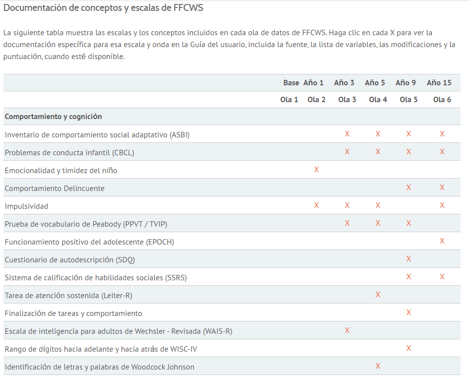

# Experiencias  sobre el almacenamiento de datos de investigación

En el presenta apartado presentamos un conjunto de repositorios digitales de materiales de investigación. Se realizaran comentarios, evaluaciones y destacaran aportes de estos repositorios digitales. Para ordenar su presentación primero revisaremos quellas experiencias internacionales que han destacado como las mejores en el ambito. Luego veremos algunas experiencias a nivel latinoamericano y chileno, para evaluar sus fortalezas y debilidades en base a los criterios y estándares presentados en la sección anterior. 


## Existosos repositorios internacionales

### ICPSR

Este es un consorcio internacional de más de 750 instituciones académicas y organizaciones de investigación, el Consorcio Interuniversitario de Investigación Política y Social (ICPSR) proporciona liderazgo y capacitación en acceso a datos, curación y métodos de análisis para la comunidad de investigación en ciencias sociales.

ICPSR mantiene un archivo de datos de más de 250.000 archivos de investigación en las ciencias sociales y del comportamiento. Alberga 21 colecciones especializadas de datos en educación, envejecimiento, justicia penal, abuso de sustancias, terrorismo y otros campos.A continuación se presenta una visualización de un ejemplo dos ejemplos de datos de este repositorio.

El ejemplo que se presenta a continuación posee como propósito comprender mejor el problema de la agresión sexual entre las mujeres afroamericanas en Maryland Estados Unidos , evaluar el uso de los recursos disponibles en respuesta a la agresión sexual y explorar el uso de fuentes alternativas de atención [@weist_African_2009]. Los investigadores entrevistaron a 223 mujeres víctimas de agresión sexual (Parte 1 y Parte 2) entre enero de 2004 y julio de 2005 y realizaron 21 grupos focales (Parte 3). A continuación puede ver la pagina web para observar los recursos que posee. 


<iframe width="900" height="400" src="https://www.icpsr.umich.edu/web/ICPSR/studies/25201" frameBorder="0"></iframe>

Como puede verse se ofrece al usuario una descripción general del documento, lo cual facilita a los investigadores evaluar la pertinencia de  su uso. Tambien se puede descargar la documentación y los datos del estudio, pero dado la temática y la importancia de ser prudentes con su divulgación estos deben solicitarse explicando el uso investigatívo que se dará para que los autores evaluen si se dara acceso a los datos. 

En terminos FAIR este documento poseee un identificador, es encontrable y esta en un fomrato que es ampliamente utilizado el pdf. No obstante quizas seria bueno que las entrevistas tambien esten en formato de texto plano txt, para garantizar su perdurabildiad al largo plazo. 

La siguiente base de datos trabaja sobre el desarrollo de los adolecentes y cuenta con más de 10 olas [@mortimer_Youth_2009]. Adempas a sido descargadad más de 100 mil veces, y posee más de 209 publicaciónes asociadas, lo que da cuenta de la buena difución con la que ha contado esta base datos y su posibilidad de ser usada por otros investigadores. Le invitamos a revisar los componentes en el repositorio. 

<iframe sandbox="allow-forms allow-scripts" width="900" height="400" src="https://www.icpsr.umich.edu/web/ICPSR/studies/24881/datadocumentation" frameBorder="0"></iframe>


Un problema frecuente con los metadatos es que se requiere utilizar un formato de metadatos en particular, formato que no siempre acomoda a todos quienes requieran de ellos y además cambien en el tiempo [@gomez_Datos_2016]. Al respecto esta pagina posee como ventaja que permite al usuario descargar los metadatos en distintos formatos. 

Evaluado desde el punto de vista FAIR, podemos decir que cumple en buena medida los criterios, posee un identificador incluido en los metadatos que ademas tiene un protocolo de comunicación estandarizado ("http//"). Si bien en este documento se puede acceder directamente a los materiales, en otros proyectos de ICPSR se requiere autorización para ello, lo cual da cuenta de lo diámico y flexible de la plataforma.

Para descargar los datos se debe generar una cuenta que puede ser un usuaro asociado a un correo, una cuenta google, linkenid o ocid. Es bastante sensillo y rapido generar la cuenta para descargar los datos. Al hacerlo se nos adbierte las condiciones de uso y la licencia con la que cuenta la base de datos lo cual esta en linea con Fair. 

En terminos de interoperabilidad al descargar la base de datos se pueden elegir entre multiples fomratos para los datos lo cual facilita su uso por distintos investigadores. 

No obstante sus buenos estandares de almacenamiento, no se puede acceder a los datos de esta investigación si no se es miembro de una orgnaizaicon en alianza con ICPSR. 

Un aspecto destacable respecto a este repositorio es que posee una pestaña donde se pueden encontrar todos las publicaciones relacionadas con este conjunto de datos, lo cual fomenta la colaboración y ayuda a eliminar la ineficiente practica de "Reinventar la rueda". 

      Evaluar segun el resto de los parametros. 
      
      
      Diccionario sobre temas de almacenamiento de datos para cientiestas sociales. 
      https://www.icpsr.umich.edu/web/ICPSR/cms/2042  Documentación es un termino adecuado.     
      
      https://www.icpsr.umich.edu/files/ICPSR/curation/preservation/policies/dp-policy-outline.pdf 
      gia de politicas

### Qualitative Data repository

El repositorio de datos cualitativos (QDR) es un archivo dedicado para almacenar y compartir datos digitales (y la documentación adjunta) generados o recopilados a través de la investigación cualitativa y de múltiples métodos en las ciencias sociales. QDR proporciona servicios de consultoría en gestión de datos y selecciona activamente todos los proyectos de datos, manteniendo el valor y la utilidad de los datos a lo largo del tiempo y asegurando su disponibilidad y posibilidad de encontrarlos para su reutilización.

A continuación, se presenta una página web ya referenciada en este documento sobre la participación de género en el desarrollo comunitario en torno a los fondos climáticos de descentralización. Este trabajo ofrece un conjunto de documento como las pautas de Focus Groups y sus transcripciones, aunque solo se tiene de libre acceso las pautas y para acceder a las transcripciones se requiere una cuenta y solicitarlas a los investigadores responsables mediante la página. Si gusta puede revisar dicho contenido en el siguiente [link](https://data.qdr.syr.edu/dataset.xhtml?persistentId=doi:10.5064/F6HTXF0H)

Este repositorio cuenta con un identificador indicado en metadatos contundentes que además están indexados en un buscador web. También poseen un protocolo de comunicación estandarizado, además de poseer medios para la autorización del uso del material. 

Además, la página facilita el uso permitiendo previsualizaciones de los documentos que se encuentra abiertos, recurso que se encuentra igualmente en los otros buenos ejemplos de repositorios de datos.

Otra temática importante que es trabajada por este repositorio es su apoyo en el hacer anónimos los datos, lo cual da cuenta de un compromiso por resguardar la seguridad de los investigadores y apoyarles como sugiere necesario el documento de Autoevaluación RISE. 

En vista de que los datos son accesibles si se los solicita, y considerando la importancia ética de generar consentimientos informados coherentes con la ciencia abierta [@dennis_Privacy_2019], se puede hacer una crítica al hecho de que el consentimiento informado en el estudio no explicita a los sujetos de investigación que las entrevistas se pondrán a disposición de la comunidad científica mediante solicitud.

Como aspectos positivos esta página también cuenta con la posibilidad de exportar los metadatos en distintos formatos ampliamente reconocidos como DC, DDI, JSON. 

Respecto a los factores de éxito señalados por CILAC, se señala la importancia de los incentivos para los investigadores. Entre estos incentivos el reconocimiento y las citas son importantes. Al respecto el repositorio expuesto posee pocas descargas (88) y ninguna cita, esto podría ser eventualmente un problema de difusión. 


### UK Data Service

El Servicio de Datos del Reino Unido está financiado por el Consejo de Investigación Económica y Social (ESRC) para satisfacer las necesidades de datos de investigadores, estudiantes y profesores de todos los sectores, incluidos el mundo académico, el gobierno central y local, organizaciones benéficas y fundaciones, centros de investigación independientes, grupos de expertos, y consultores empresariales y del sector comercial.

La recopilación del Servicio de datos del Reino Unido incluye las principales encuestas patrocinadas por el gobierno del Reino Unido, encuestas transnacionales, estudios longitudinales, datos del censo del Reino Unido, agregados internacionales, datos comerciales y datos cualitativos.


Esta página también logra satisfacer los principios Fair. En términos del repositorio estos también se adaptan a los criterios de autoevaluación RISE, en los cuales se señala a la importancia de generar apoyo a los usuarios, acción realizada por el UK Service para sus miembros. 

Para acceder a los datos se requiere una cuenta registrada, la cual solo es para personas que son parte de las organizaciones afiliadas al repositorio.


### Dataverse Harvard

El Proyecto Dataverse es una aplicación web de código abierto para compartir, preservar, citar, explorar y analizar datos de investigación. Facilita la puesta a disposición de otros de los datos y le permite replicar el trabajo de otros con mayor facilidad. Los investigadores, las revistas, los autores de datos, los editores, los distribuidores de datos y las instituciones afiliadas reciben crédito académico y visibilidad en la web. 

De este modo, dataverse no solo apoya el proceso de almacenamiento de matariales e información para la investigación sino que tambien posibilita el almacenamiento de codigos para la reproducibilidad, comprendida como la posibilidad de volver a ejecutar un analisis con los mismos datos y mismos procedimientos usualmente especificados en codigos. 

Un repositorio de Dataverse es la instalación del software, que luego aloja varios archivos virtuales llamados colecciones de Dataverse. Cada colección de Dataverse contiene conjuntos de datos, y cada conjunto de datos contiene metadatos descriptivos y archivos de datos (incluida la documentación y el código que acompañan a los datos). Como método de organización, las colecciones de Dataverse también pueden contener otras colecciones de Dataverse.

Segun la institución, la idea central detrás del Proyecto Dataverse es automatizar gran parte del trabajo del archivero profesional y proporcionar servicios y distribuir crédito al creador de datos. Antes del Proyecto Dataverse, los investigadores se vieron obligados a elegir entre recibir crédito por sus datos, controlando la distribución ellos mismos pero sin garantías de conservación a largo plazo, o tener garantías de conservación a largo plazo, enviándolos a un archivo profesional pero sin recibir mucho crédito. El Proyecto Dataverse rompe esta mala elección: colocamos una colección de Dataverse (un archivo virtual) en su sitio web que tiene el aspecto, la sensación, la marca y la URL de su sitio web, junto con una cita académica para los datos que le brindan crédito y visibilidad web completos.

El siguiente es un ejemplo de conjunto de datos sobre la replicación de un estudio sobre lasa actitudes de los residentes urbanos hacia la migración ambiental en Kenia y Vietnam.

<iframe sandbox="allow-forms allow-scripts" width="900" height="400" src="https://dataverse.harvard.edu/dataset.xhtml?persistentId=doi:10.7910/DVN/PBLRV6"></iframe>


Evaluando este conjunto de datos desde la perspectiva Fair podemos decir que es un buen ejemplo y cumple con los requisitos.

Un aspecto destacable de este repositoro es que poseen un previsualizador de los datos, asi como un espacio para observar las distintas versiones de los archivos.  


### GESIS

Gesis es actualmente la institión con mayor infraestructura para CCSS de alemania. Ofrece una gran cantida dde servicios de acceso a datos de invesitgaciónes, publicaciones, instrumentos de medición entre otros. 


@europeancommissionbrussels_Flash_2015

### REPOSITORIO EN OSF,

Open Science Framework (OSF) es una plataforma con la intención de centralizar las labores de almacenamiento e infraestructura digital que son necesarios para las distintas etapas del proceso investigativo. Esta página está hecha para almacenar hipótesis, diseños de investigación, bases de datos, resultados y versiones de los artículos o publicaciones finales. Esta plataforma puede ser utilizada gratuitamente por cualquier usuario, lo que permite a los investigadores concentrarse en investigar y dejando estas funciones a la plataforma. 

Si se poseen recursos de una institución y sus participantes lo desean, pueden contratar un servicio espacial de OSF que permite hacer páginas web de los distintos proyectos de investigación de una institución, vinculando estos proyectos entre sí. A continuación, se expone una página que Almacena investigaciones de a2jLab un laboratorio de acceso a la justicia. Puede acceder al repositorio mediante el siguiente [link](https://osf.io/institutions/a2jlab/)

Si bien las investigaciones depositadas no utilizan todos los recursos, se puede apreciar que es posible crear un conjunto de recursos de distinto tipo adecuados para la investigación social. Por ejemplo, la plataforma permite hacer pre-registros para investigaciones cuantitativas y cualitativas. Los pre-registros implican exponer con anterioridad las hipótesis que se poseen antes de hacer el análisis de los datos, para evitar que se generen hipótesis a posteriori señalando engañosamente que fueron pensadas teóricamente anteriores al análisis de la información.  

Como aspecto negativo se debe señalar que si bien la página genera identificadores únicos que pueden servir tanto para los artículos como para las bases de datos y se poseen metadatos, estos últimos son bastante restringidos. No se pueden agregar nuevas celdas de información para los metadatos ni se pueden exportar a distintos estándares de metadatos.


### fragilefamilies

Una experiencia en el almacenamiento de bases de datos es el centro de investigación "Fragile Families" que posee un repositorio abierto de su estudio longitudinal. Esta plataforma facilita la búsqueda de datos a los investigadores a partir de un [buscador de datos](https://fragilefamilies.princeton.edu/data-and-documentation/metadata-explorer).  Este último muestra un resumen de las variables de cada ola de su estudio longitudinal como se puede observar en la imagen posterior. Considero que este es un valioso recurso que facilita a los investigadores la toma de decisiones respecto a los datos a utilizar.  

```{r echo=FALSE, fig.align='center', fig.cap="Tolerar ideas distintas es el valor más importante que debieran aprender"}

```
  

## Experiencia regional. 


### LAPOP.

Segun su propia pagina web  [@lapop_Inicio_2020] LAPOP es la principal institución académica que realiza encuestas de opinión pública en las Américas, con más de 30 años de experiencia. Como centro de excelencia en investigación por encuestas, LAPOP usa enfoques y métodos innovadores con los “estándares más altos” para llevar a cabo encuestas nacionales; conducir estudios de evaluación de impacto, y producir reportes acerca de las actitudes, evaluaciones y experiencias de los individuos. El Barómetro de las Américas es la única encuesta comparativa y científicamente rigurosa que cubre 34 naciones incluyendo Norte, Centro y Sur América, así como también, un significativo número de países en el Caribe. Cada año publica docenas de estudios académicos de alta calidad y artículos de relevancia para la elaboración de políticas públicas.

Cabe destacar que si bien esta es una experiencia de almaceneamiento de datos para investigaciones posee algunas diferencias. Por ejemplo es una plataforma solo para almacenar encuestas del proyecto LAPOP y no asi de otras investigaciones afines. Por ello los servicios de clasificación de datos y priorizacion no son tan importantes por que no se posee un volumen tan grande de datos.


<iframe width="900" height="400" src="https://www.vanderbilt.edu/lapop-espanol/"></iframe>


como se puede ver en la proyección de la pagina esta ordena las bases de datos en base a paises, ademas de tener otras entradas. Respecto a su adecuación a los estandares internacionales, se puede ver que no cumple con los parametro FAIR, ya que no posee un identificador único ni metadatos adecuados. 

Como aspecto positivo las bases de datos cuantitativas son ofrecidos en dos de los formatos más utilizados SPSS y STATA. Tambien entragan documentacion fundamental para el trabajo con bases de datos como son los informes tecnicos y los cuestionarios. En terminos de facilitar el uso, no se entregan previsualizaciones de los datos, ni la posibilidad de graficar frecuencias, lo cual podria ser un aporte la democratización de los datos. 


### Plataforma integrada de datos del MINCYT Argentina


A partir de la información recopilada por el foro CILAC, se puede decir que en algunos países del continente los gobiernos están realizando esfuerzos por fomentar la apertura de los datos. Por ejemplo, en argentina, a partir de una nueva ley de Acceso abierto, se propuso una [plataforma integrada para el acceso a datos](http://datos.mincyt.gob.ar/). Esta plataforma entrega información sobre distintas disciplinas. Entre estos trabajos, el más cercano a las ciencias sociales son los [Datos de personal de ciencia y tecnologia](https://datasets.datos.mincyt.gob.ar/dataset/personal-de-ciencia-y-tecnologia/archivo/11dca5bb-9a5f-4da5-b040-28957126be18), que permite hacer análisis socioedmografico de los academicos. Esta plataforma posee una previsualización y una tabla con las variables que facilita el conocimiento de los datos, los cuales están disponibles para descargar distintos formatos. Esta previsualización se puede realizar a modo de tablas, gráficos y mapas. No obstante, la visualización mediante gráficos es relativamente ineficiente, puesto a que es difícil lograr gráficos que sean comprensibles.

<iframe width="900" height="400" src="https://datasets.datos.mincyt.gob.ar/dataset/personal-de-ciencia-y-tecnologia/resource/11dca5bb-9a5f-4da5-b040-28957126be18/view/50e3983a-da21-4995-ae4d-108c394b3a3a" frameBorder="0"></iframe>


En el informe de la CILAC, también se menciona el caso de Chile, Perú y México, pero ni una de las páginas de los ministerios de ciencia de estos países permite localizar las bases de datos con la que trabajaron los investigadores. Por dicho motivo este informe no ahondara en dichosos casos.

### CEPAL stats

https://estadisticas.cepal.org/cepalstat/Perfil_Regional_Economico.html?idioma=spanish


## Evaluación de experiencias nacionales.  


Hace bastantes años que a nivel nacional se realizan esfuerzos por fomentar el registro abierto de datos. La antigua Comisión Nacional de Investigación Científica y Tecnológica (CONICYT), en la página [Datos Cientificos](http://datoscientificos.cl/)[@programadeinformacioncientifica_Ciencia_2019], realiza una propuesta de politica para datos abiertos. El primer punto de dicha propuesta exige a todos los beneficiarios de CONICYT la publicación de informes con datos producidos de la investigación. En favor de dicha política se publicaron el año 2010 y 2014 dos documentos con sugerencias para la apertura de los datos.

El primero de estos informes es una revisión del estado del arte de la accesibilidad de datos [@munoz_ESTADO_2010]. se destacan las siguientes recomendaciones. 

 - A partir de la experiencia de las Políticas de Intercambio de Datos Científicos en China se evidenció la dificultad de desarrollar una política nacional de gestión cuando en la cultura científica local persistió la idea de propiedad personal. Por ello, es fundamental realizar políticas de concientización respecto a los datos abiertos. 

- En base a la recopilación de datos epidemiológicos del National Center for Health Statistics de Estados Unidos, se releva la importancia de preparar alternativas para datos sensibles. Considerando la naturaleza de los datos, es necesario en algunas ocasiones mantener los datos en la mayor confidencialidad posible. En esta línea, la organización mencionada junto con dejar los datos de acceso abierto, mantuvieron algunos datos en privado a los cuales solo se puede acceder en base a una solicitud con una propuesta de investigación y mediante una plataforma que posibilita cálculos sin permitir el acceso directo a los datos ni su transferencia. Es fundamental identificar aquellas investigaciones que requieren un resguardo mayor de datos y generar protocolos para su uso.

El segundo documento, escrito el 2014, se denomina "Datos Científicos Abiertos La Ciencia la hacemos entre todos, Programa de Información Científica" [@hernandez_Manual_2014]. Este informe posee la intención de ser un manual respecto a cómo abrir los procesos investigativos. Se destacan las siguientes recomendaciones:

 * Utilizar una licencia de Creative Commons: permiten autorizar el uso de terceros sin perder los derechos de atribución. 
 
  * Utilizar repositorios interoperables: Para facilitar la recopilación automática de datos y el uso de estos desde distintos Software, se recomienda poseer buenos metadatos siguiendo los parámetros de interoperabilidad de [Dublin Core](http://dublincore.org/). Los metadatos son “los datos sobre los datos” es decir aquella información que nos permite saber a qué corresponde la base de datos, quienes y cuando la crearon entre otras informaciones relevantes. Esta página propone una decena de metadatos indispensables para la interoperabilidad (Ej. creador, colaborador, editor, título, fecha, idioma, formato, tema, descripción, identificador, relación, fuente, tipo, cobertura y derechos, entre otros) [@dublin-core_Dublin_2020]. Si bien esta publicación no da cuenta de que metadatos debe ser específicamente utilizado a partir de la información anterior producida por lisa podemos decir que es beneficioso utilizar el conjunto de metadatos para social-science que es un conjunto bastante parsimonioso de información.

Pueden observarse documentos que buscan la publicación abierta de las bases de datos desde varios años. Por ejemplo, (en esta pagina)[https://www.uchile.cl/portal/informacion-y-bibliotecas/servicios-de-biblioteca/bases-de-datos/57683/indice-por-tema]. No obstante como puede verse en ese sitio aun no es posible encontrar a libre disposición los resultados y los materiales de las investigaciones dando cuenta de una buena  politica que no ha sido terminada.  

A, a las bases de datos de la Univercidad Diego Portales (UDP) y a la información nacional producida por el PNUD-Desiguales. Estas son buenas experiencias  ya que poseen una amplia llegada a los investigadores siendo estas bases utilizadas por ellos. En vista de su popularidad y accesibilidad por parte de los usuarios, se observo el modo en que se hacen accesibles las bases llegando a los siguientes aprendisajes y sujerencias: 

### CEP

El Centro de Estudios públicos produce constantemente encuestas de opinión publica, con bastante contenido electoral. Esta es una de las bases de datos más conocidas en el campo de la sociología de Chile. Y en el último tiempo mejoro su plataforma de almacenamiento. 

Ahora la página posee un buscador de datos, un espacio para descargar una base consolidada longitudinal con los distintos estudios y un recurso para realizar gráficos en línea, lo cual fomenta la utilización por el público no especializado. Además, como siempre, la página cuenta con material suficiente para utilizar las bases de datos como las fichas técnicas, documentos de resultados y las bases de datos en distintos formatos (SPSS, STATA y R). Respecto a las bases de datos es de las pocas bases de datos analizadas que codifico las etiquetas de la base de datos en UTF-8. Como aspectos negativos se puede señalar que no se cuenta con recurso para descargar metadatos ni posee un identificador único

 
incluir: casen, desiguales-pnud (no fairs)

### COES-Dataverse

posee metadatos y doi. posee información necesaria para trabajar. permite almacenar distintos documentos.

Como aspecto positivo ofrece metricas sobre la descarga de los datos que permiten generar perfiles sobre el publico. Esto esta en linea con lo señalado por CILAC respecto a la construccion de metircas sobre los registros que permitan evaluación.


### Movid.

En el corto plazo la experiencia de almacenamiento de datos relativos al covid es un caso interesante de aprovechar en términos de aprendizaje. [Datos Covid Ministerio de Ciencias](https://www.minciencia.gob.cl/covid19). Esta recopilación de los casos se guardó en la plataforma Github cuenta con un visualizador Shiny que permite a usuarios básicos en línea realizar análisis descriptivos sobre las variables. 


<iframe width="900" height="400" src="https://www.movid19.cl/app" frameBorder="0"></iframe>

En una línea similar el proyecto del [observatorio de cohesión social](https://ocs-coes.netlify.app/app/) generado por COES, es una buena experiencia, no tanto en el almacenamiento de bases de datos sino en la visualización de los mismos la cual fomenta para la democratización del conocimiento.

